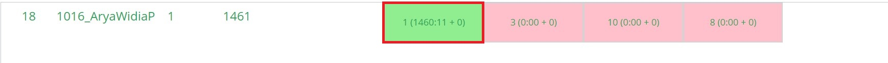
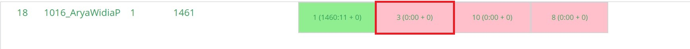
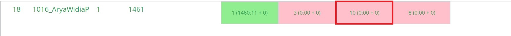
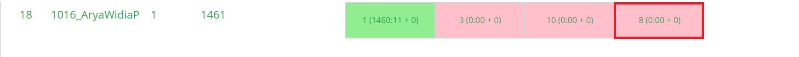

# struktur-data-h-praktikum-2-2021

## Distribusi Vaksin

### Verdict

AC saat revisi

#### Bukti



### Penjelasan Soal

Terdapat V rumah, dengan E jalan yang menghubungkannya, dan Q vaksin yang akan diantar. Input yang diberikan adalah V, E, Q, ruas jalan dan waktu tempuh yang diperlukan sebanyak E baris, dan urutan rumah yang akan dikunjungi sebanyak Q baris.

### Penjelasan Solusi

p

### Visualisasi Solusi

Untuk mempermudah visualisasi solusi dari permasalahan Nadut Belajar, digunakan sample input berikut:

```c
6 1
7 10 21 45 30 29
7
```


Semua pointer start di root.


Karena data dari node yang ditunjuk p3 lebih besar dari value, geser p3 ke kiri node. depth + 1.


`p3` belum menunjuk node yang sesuai dan depth > 1, p2 pindah ke p3.


Karena data dari node yang ditunjuk p3 lebih besar dari value, geser p3 ke kiri node.


Node yang ditunjuk p3 memiliki nilai yang dicari, sehingga cetak selisih dari anak-anak node yang ditunjuk p1.

Output:

```c
20
```

## Roy Sang Kurir

### Verdict

WA

#### Bukti



### Penjelasan Soal

Diberikan pasangan angka sejumlah N angka yang merupakan rute pengiriman. Dicari apakah rute tersebut membentuk suatu cycle.

### Penjelasan Solusi

Pertama, masukkan pasangan angka sebagai edge dalam graph. Lalu, lakukan DFS pada graph. Jika saat DFS ditemukan vertex yang sudah dilewati (visited == true), terdapat cycle dalam graph. Jika tidak, tidak terdapat cycle dalam graph.

Dalam fungsi main, pertama diambil N. Kemudian, dibuat graph dengan vertex sebanyak N. Lalu, diambil input untuk X dan Y, dan dimasukkan ke dalam graph sebanyak N kali. Setelah loop selesai uji graph dengan fungsi isCyclic (`g.isCyclic()`). Jika fungsi tersebut mengembalikan nilai `true`, keluarkan `Ada Cycle!`. Jika `false`, keluarkan `Tidak Ada Cycle!`.

### Visualisasi Solusi

Untuk mempermudah visualisasi solusi dari permasalahan Bucyn, digunakan sample input berikut:

```c
7
Taro 100
Taro 74
Cari 100
Taro 152
Taro 21
Taro 33
Cari 100
```


Masukkan 100 dan 74 (command `Taro`)


Mencari nilai tumpukan 100. Karena inorder, dari root ke node kiri terlebih dahulu.


Nilai node tidak sesuai dengan yang diminta, sehingga *count + 1. Kanan node tidak ada, kembali ke parent node.


Nilai node merupakan yang diinginkan. return, dan program main mencetak `Kasetnya ada di tumpukan ke - 2`


Masukkan 152, 21, dan 33 (command `Taro`)


Cari 100. Telusur ke kiri dahulu.


Telusur ke kiri lagi.


Nilai node tidak sesuai dengan yang diminta, sehingga *count + 1. Kanan node tidak ada, kembali ke parent node.


Nilai node tidak sesuai dengan yang diminta, sehingga *count + 1. Lanjut ke kanan node.


Nilai node tidak sesuai dengan yang diminta, sehingga *count + 1. Kanan node tidak ada, kembali ke parent dari parent node.


Nilai node merupakan yang diinginkan. return, dan program main mencetak `Kasetnya ada di tumpukan ke - 4`

Output:

```c
Kasetnya ada di tumpukan ke - 2
Kasetnya ada di tumpukan ke - 4
```


### Verdict

WA

#### Bukti



### Penjelasan Soal

j

### Penjelasan Solusi

j

### Visualisasi Solusi

Untuk mempermudah visualisasi solusi dari permasalahan Part Time, digunakan sample input berikut:

```c
5 5
1 13000
2 5500
3 8750
4 21900
5 30000
4 4
2 3
2 1
1 7
3 2
```


Modifikasi node untuk menyimpan harga.


Masukkan semua input ke dalam tree.

Y = 4, Cari 4. Hasilnya true sehingga lanjutkan operasi dalam loop.


Ambil node yang memiliki ID = 4 dengan fungsi `_search`, simpan pada pointer p.


Lalu, kalikan p->price dengan X, lalu tambahkan ke Z.


Untuk dua input selanjutnya, sama seperti input di atas karena IDnya ada.


Y = 7. Karena tidak ada barang dengan ID 7, keluarkan `Maaf barang tidak tersedia`


Y = 2. Barang dengan ID 2 ada, sehingga harganya ditambahkan ke Z

Terakhir, cetak Z.

Output:

```c
Maaf barang tidak tersedia
147600
```

## Sayonara

### Verdict

WA

#### Bukti



### Penjelasan Soal

Diberikan suatu papan catur dengan pola seperti berikut:


Sebuah bidak dapat bergerak ke arah utara, timur, selatan, barat. Untuk berpindah dari P ke Q, bidak catur harus melangkah secara berurutan dari P ke P+1, P+2, P+3, sampai ke Q. Diminta untuk mengeluarkan seberapa banyak langkah yang dibutuhkan untuk berpindah dari P ke Q beserta arahnya. 

### Penjelasan Solusi

Arah pergerakan maksimal dalam satu arah mengikuti pola 1, 1, 2, 2, 3, 3. (1U, 1T, 2S, 2B, seterusnya). Dengan informasi ini, dibuat loop dengan iterasi maksimalnya adalah sebanyak Q kali, dengan 

### Visualisasi Solusi

Untuk mempermudah visualisasi solusi dari permasalahan Kata-Kata, digunakan sample input berikut:

```c
3
soalnya
mudah
dipahami
3
dan
soalnya
singkat
```


Hasil input data pada trie.


Mencari "dan", dimulai dari node root.


Cek apakah node root punya child node untuk karakter 'd'. Karena ada, lanjut cek ke karakter berikutnya.


Cek apakah node 'd' punya child node untuk karakter 'a'. Karena tidak ada, hentikan pencarian dan return false. Karena fungsi main menerima false, print `0`.


Mencari "soalnya". Tiap karakter dalam kata "soalnya" ditemukan dalam rangkaian node. Terakhir, karakter 'a' merupakan karakter terakhir dari "soalnya" sehingga cek isEndOfWord pada node yang menyimpan karakter 'a'. Karena nilainya true, fungsi search akan mengembalikan nilai true ke fungsi main dan di print `1` melalui fungsi main.


Mencari "singkat". Mirip dengan pencarian "dan", pencarian berhenti di karakter kedua ('i') karena tidak terdapat node children yang melambangkan karakter tersebut. Dengan demikian, dikembalikan nilai false dan fungsi main melakukan print `0`.

Output:

```c
0
1
0
```

