# struktur-data-h-praktikum-2-2021

## Distribusi Vaksin

### Verdict

AC saat revisi

#### Bukti


### Penjelasan Soal

Terdapat V rumah, dengan E jalan yang menghubungkannya, dan Q vaksin yang akan diantar. Input yang diberikan adalah V, E, Q, ruas jalan dan waktu tempuh yang diperlukan sebanyak E baris, dan urutan rumah yang akan dikunjungi sebanyak Q baris. Diminta untuk menghitung total waktu minimum yang dibutuhkan untuk mengantarkan vaksin ke semua rumah yang telah disebutkan.

### Penjelasan Solusi

Solusi untuk permasalahan ini menggunakan graf yang direpresentasikan dengan adjacency list. Kemudian, jalan dengan waktu tempuh tercepat dari rumah pertama ke rumah selanjutnya dicari dengan algoritma Dijkstra. Implementasi algoritma Dijkstra yang digunakan dapat mengembalikan waktu tempuh tersingkat antara satu rumah dengan rumah yang lainnya, sehingga untuk mencari total waktu minimum yang dibutuhkan untuk mencapai semua rumah yang akan diantarkan vaksin adalah penjumlahan dari waktu tempuh tersingkat antara rumah.

Implementasi algoritma Dijkstranya adalah sebagai berikut. Pertama, dibuat sebuah Min Heap yang berukuran banyaknya vertex dalam graf, dan setiap node dari Min Heap membawa nomer vertex dan besarnya waktu tempuh vertex. Lalu, inisialisasi heap tersebut dengan memasukkan vertex asal sebagai root dan pada node tersebut nilai waktu tempuhnya adalah 0, dan vertex yang lainnya diberikan nilai waktu tempuhnya infinit. Selanjutnya, lakukan loop selama heap tidak kosong. Di dalam loop, lakukan:

1. Ambil u dari heap, yaitu vertex dengan nilai waktu tempuh tersingkat.
2. Cek apakah v, vertex yang terhubung ke u, terdapat dalam heap. Jika iya, jika nilai waktu tempuh v lebih dari jumlah waktu tempuh u-v dengan nilai waktu tempuh u, ubah nilai v (dengan jumlah tersebut).

Dengan algoritma tersebut (yang disusun dalam fungsi dijkstra), akan didapatkan nilai waktu tempuh tersingkat dari rumah asal (`src`) ke tujuan (`dest`).

Di dalam fungsi main, ambil input V, E, Q. Lalu, buat loop sebanyak E kali untuk menerima u, v, w dan memasukkannya ke dalam weighted graph `graph`. Lalu, ambil rumah yang pertama dikunjungi. Kemudian, lakukan loop sebanyak Q-1 kali (karena input asal rumah yang pertama sudah dilakukan), isinya menerima rumah tujuan, menambahkan waktu tempuh tersingkat rumah asal (`src`) ke tujuan (`dest`) ke total waktu tempuh (`sum`), lalu mengganti nilai `src` dengan `dest` karena waktu yang dihitung selanjutnya akan dimulai dari rumah `dest` sekarang. Terakhir, keluarkan nilai `sum`.

### Visualisasi Solusi

Untuk mempermudah visualisasi solusi dari permasalahan Distribusi Vaksin, digunakan sample input berikut:

```c
5 6 5
1 2 6
1 4 12
3 2 8
3 4 4
3 5 10
5 4 16
1
5
2
4
3
```

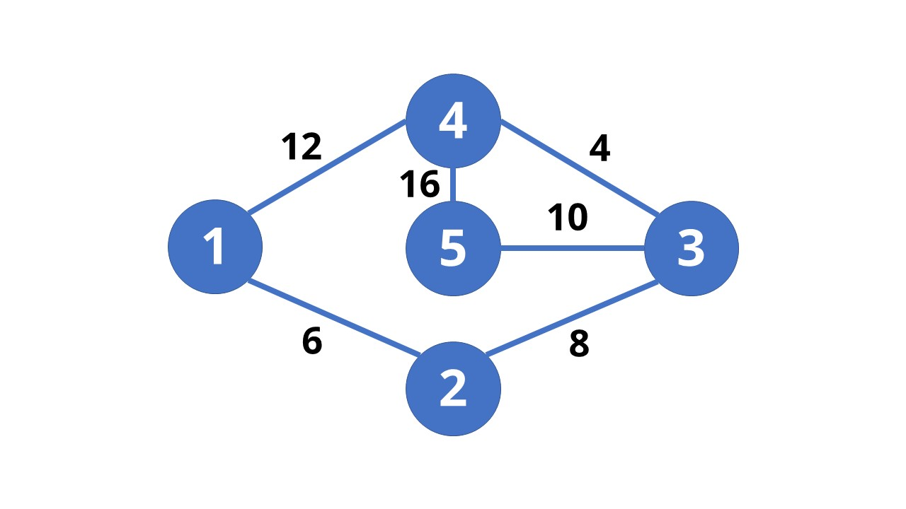

Graf yang terbentuk dari input.

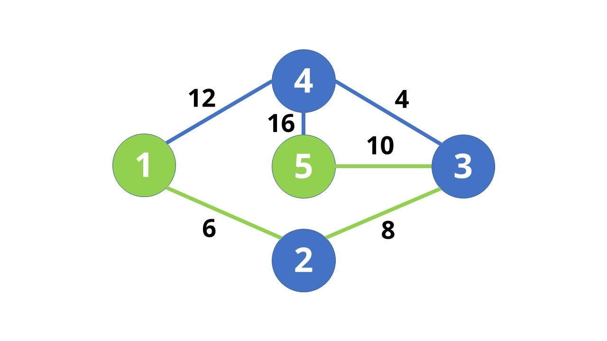

Input pertama adalah 1, sehingga `src = 1`, dan input selanjutnya adalah 5 `dest=5`. Program dijkstra akan mengembalikan waktu tempuh tersingkat dari kedua rumah tersebut dan ditambahkan ke `sum`.
`src` diubah ke 5.


Input selanjutnya adalah 2 `dest=2`. Program dijkstra akan mengembalikan waktu tempuh tersingkat dari kedua rumah tersebut dan ditambahkan ke `sum`. `src` diubah ke 2.

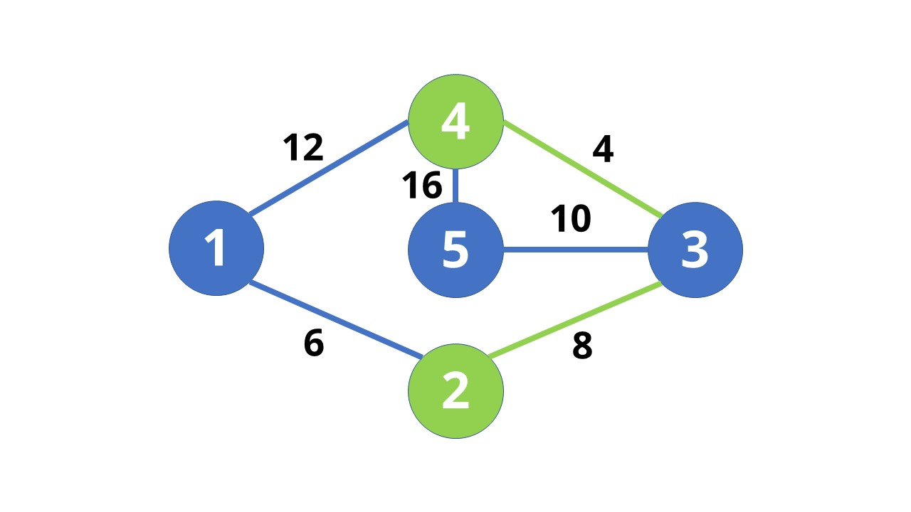

Input selanjutnya adalah 4 `dest=4`. Program dijkstra akan mengembalikan waktu tempuh tersingkat dari kedua rumah tersebut dan ditambahkan ke `sum`. `src` diubah ke 4.

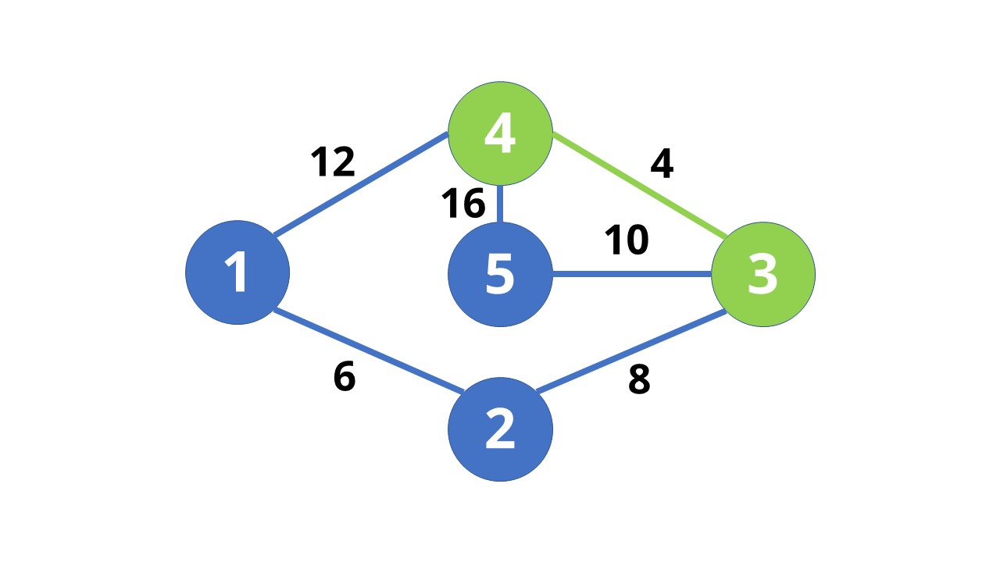

Terakhir, input adalah 3 `dest=3`. Program dijkstra akan mengembalikan waktu tempuh tersingkat dari kedua rumah tersebut dan ditambahkan ke `sum`. `src` diubah ke 3.
Lalu, program main akan mengeluarkan nilai `sum`.

Output:

```c
58
```

## Roy Sang Kurir

### Verdict

WA

#### Bukti


### Penjelasan Soal

Diberikan pasangan angka sejumlah N angka yang merupakan rute pengiriman. Dicari apakah rute tersebut membentuk suatu cycle.

### Penjelasan Solusi

Pertama, masukkan pasangan angka sebagai edge dalam graph. Lalu, lakukan DFS pada graph. Setiap vertex yang telah dilewati akan ditandai dengan `visited == true` Jika saat DFS ditemukan vertex yang menyambung ke vertex sekarang sudah dilewati (`visited == true`), terdapat cycle dalam graph. Jika tidak, tidak terdapat cycle dalam graph. Algoritma ini diimplementasikan dalam subprogram `isCyclic`.

Dalam fungsi main, pertama diambil N. Kemudian, dibuat graph dengan vertex sebanyak N. Lalu, diambil input untuk X dan Y, dan dimasukkan ke dalam graph sebanyak N kali. Setelah loop selesai uji graph dengan fungsi isCyclic (`g.isCyclic()`). Jika fungsi tersebut mengembalikan nilai `true`, keluarkan `Ada Cycle!`. Jika `false`, keluarkan `Tidak Ada Cycle!`.

> *Kemungkinan perbaikan solusi:*
>
> Setelah saya telusuri, graf yang dibentuk dari soal seharusnya undirected graph, sedangkan untuk solusi ini memakai undirected graph.

### Visualisasi Solusi

Untuk mempermudah visualisasi solusi dari permasalahan Roy Sang Kurir, digunakan sample input berikut:

```c
5
1 0
0 2
2 1
0 3
3 4
```

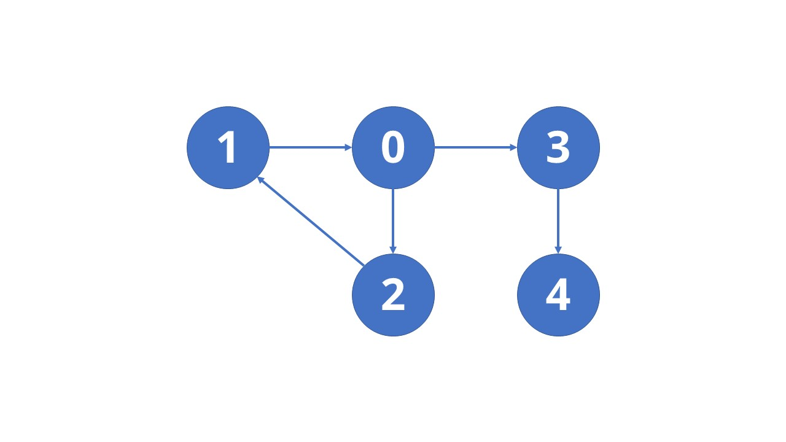

DFS dimulai dari titik 0.

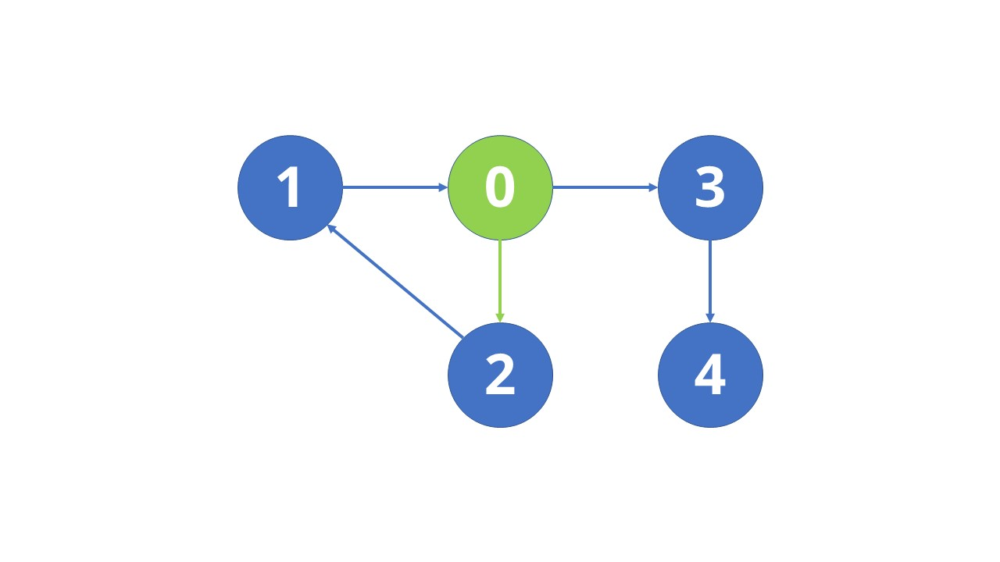

Lanjut ke vertex yang ditunjuk oleh vertex 0 dengan nilai terkecil (2).

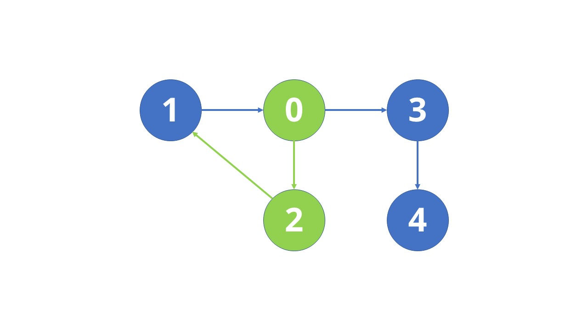

Lanjut ke vertex yang ditunjuk oleh vertex 2  (1).

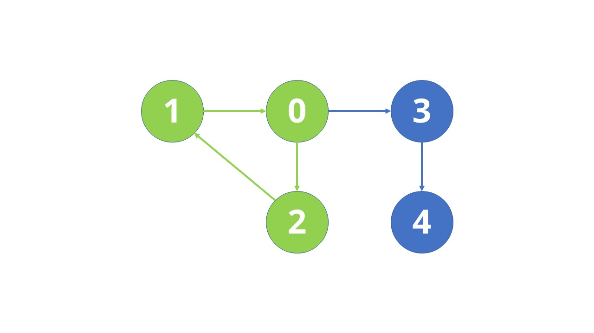

Lanjut ke vertex yang ditunjuk oleh vertex 1 (0). Karena menurut informasi dari `recStack` 0 sudah dikunjungi, kembalikan nilai true. Dengan demikian, fungsi main mengeluarkan `Ada Cycle!`.

Output:

```c
Ada Cycle!
```

## Sayonara

### Verdict

WA

#### Bukti


### Penjelasan Soal

Diberikan suatu papan catur dengan pola seperti berikut:

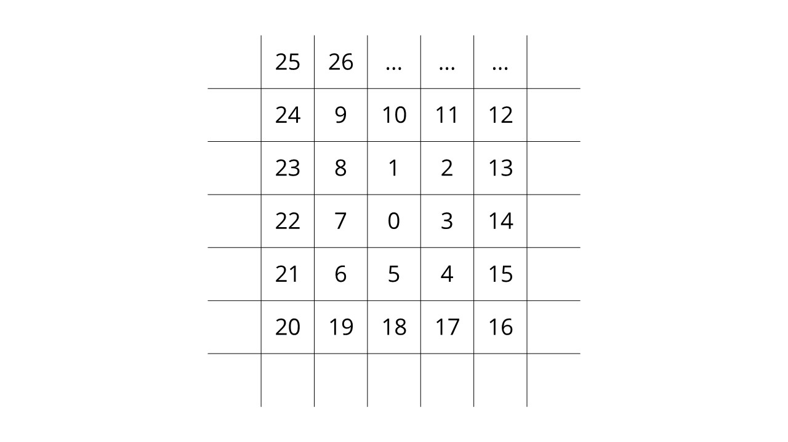

Sebuah bidak dapat bergerak ke arah utara, timur, selatan, barat. Untuk berpindah dari P ke Q, bidak catur harus melangkah secara berurutan dari P ke P+1, P+2, P+3, sampai ke Q. Diminta untuk mengeluarkan seberapa banyak langkah yang dibutuhkan untuk berpindah dari P ke Q beserta arahnya.

### Penjelasan Solusi

Arah pergerakan maksimal dalam satu arah mengikuti pola 1, 1, 2, 2, 3, 3. (1U, 1T, 2S, 2B, seterusnya). Dengan informasi ini, dibuat loop dengan iterasi maksimalnya adalah sebanyak Q kali, dengan setelah loop sebanyak i (1, 2, 3) berubah arah (dari U ke T seterusnya, dan jika sudah sampai ke arah terakhir atau B, reset ke index pertama), dan loop i tersebut diulang sebanyak 2 kali. Di dalam loop manapun, break jika pion telah mencapai target (`j == dest`). Di dalam loop terdalam, lakukan increment terhadap j tiap iterasi (menghitung langkah pion). Selama j belum mencapai source, abaikan langkahnya, hanya perlu diingat pion berada di pola berapa. Jika sudah mencapai source, mulai masukkan karakter (`dir`) ke dalam queue. Setelah semua loop break atau berhenti, keluarkan isi queue sesuai yang diinginkan soal (fungsi showQ). Semua ini dilakukan dalam fungsi findPath.

Di dalam fungsi main, buat suatu array bernama `mataangin` yang akan menyimpan arah mata angin gerakan pion. Kemudian, lakukan loop sebanyak TC atau input yang paling pertama. Setiap iterasi loop, terima lokasi awal pion (`P`) dan tujuannya (`Q`), lalu kirimkan `mataangin`, `P`, dan `Q` ke fungsi `findPath`.

> *Kemungkinan perbaikan solusi:*
>
> Karena pencarian dimulai dari 0, untuk angka yang sangat besar akan memakan waktu yang sangat banyak.

### Visualisasi Solusi

Untuk mempermudah visualisasi solusi dari permasalahan Sayonara, digunakan sample input berikut:

```c
2
8 14
3 5
```


Papan catur.

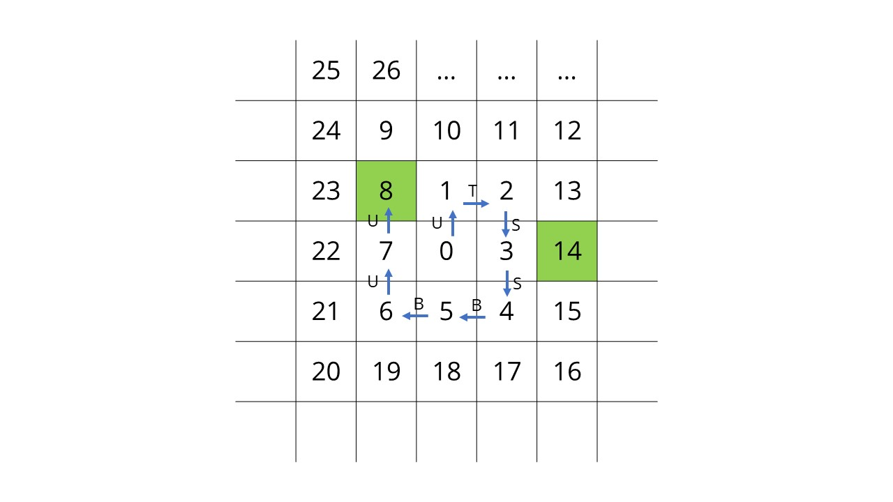

Menghitung dari titik 0. i akan bertambah 1 tiap 2 kali perulangan.

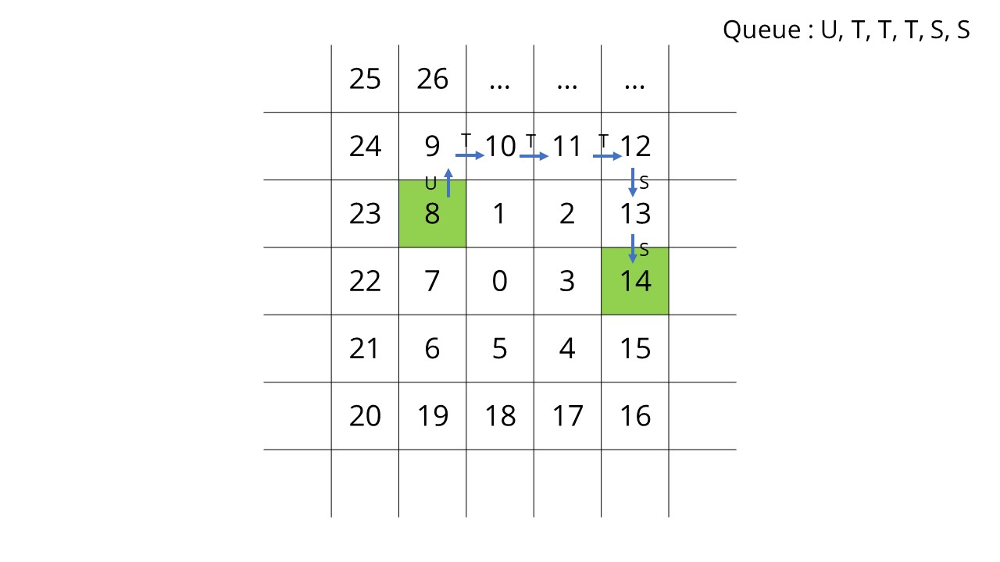

Mulai saat j (penunjuk lokasi pion sekarang) mencapai 8, masukkan karakter yang diambil dari array ke dalam queue. Hentikan semua loop saat j mencapai 14.
Lalu, keluarkan isi queue, dengan menghitung huruf-huruf yang sama. Dalam contoh ini, dikeluarkan `1U -> 3T -> 2S`

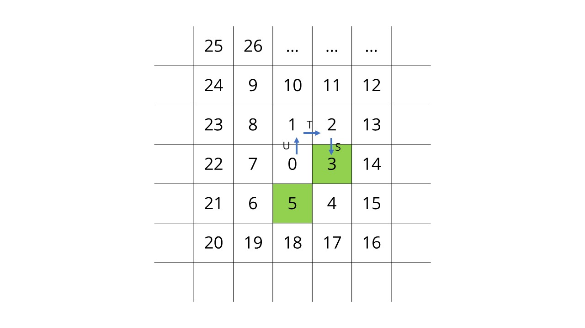

Menghitung dari titik 0. i akan bertambah 1 tiap 2 kali perulangan.

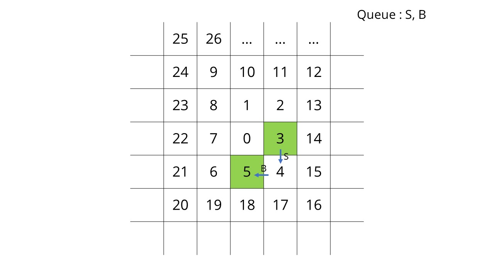

Mulai saat j (penunjuk lokasi pion sekarang) mencapai 3, masukkan karakter yang diambil dari array ke dalam queue. Hentikan semua loop saat j mencapai 5.
Lalu, keluarkan isi queue, dengan menghitung huruf-huruf yang sama. Dalam contoh ini, dikeluarkan `1S -> 1B`

```
1U -> 3T -> 2S
1S -> 1B
```
